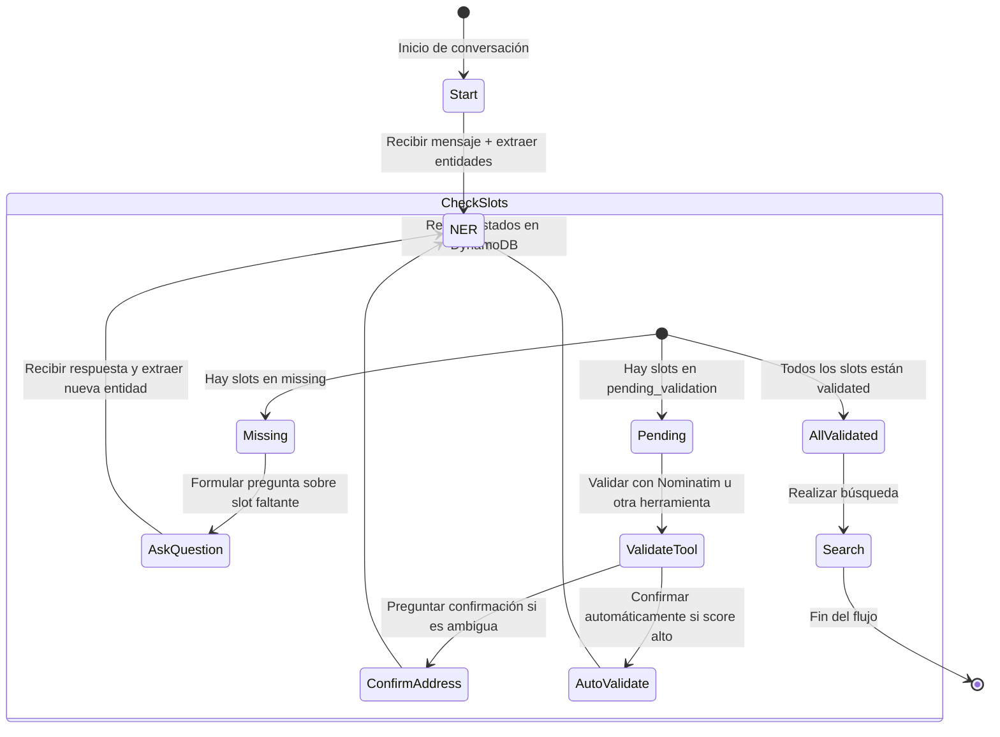

# housy-IA

CURRENT STATUS:
- dynamodb operations: OK
- chatbot conversation: OK . Stage 1. Stage 2.
- FAST API endpoints deployed.
- Dockerfile creation: OK.
- Deploy in AWS : Ok

NEXT STEPS:
- Add Chatbot stage 3 ( In proccess)

FUTURE FIXES:
- Async functions for DynamoDB writing
- Log implementation

Websites:
chatbot-api: https://chatbot-api.housycorp.com/docs
backend: https://backend.housycorp.com/api

